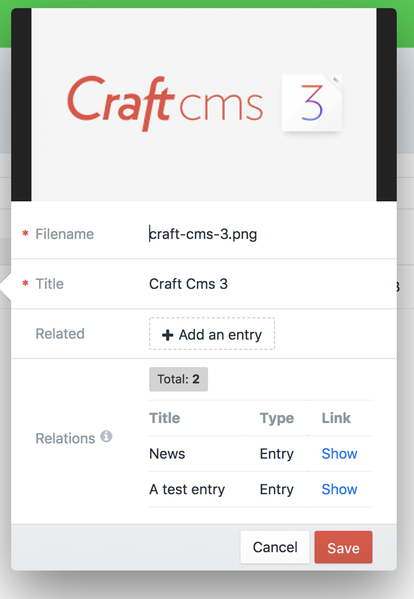
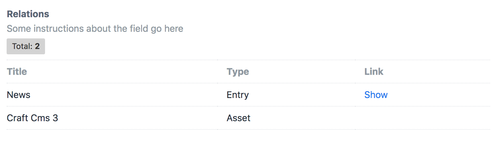

# Relations plugin for Craft CMS 3

A field type to show reverse related elements.

## Requirements

This plugin requires Craft CMS 3.0.0 or later.

## Installation

To install the plugin, follow these instructions.

1. Open your terminal and go to your Craft project:

```
cd /path/to/project
```

2. Then tell Composer to load the plugin:

```
composer require nav33d/craft-relations
```

3. In the Control Panel, go to Settings → Plugins and click the “Install” button for Relations.

## Screenshots


---


## Credits

- Relations icon by [Noun Project](https://thenounproject.com/search/?q=relation&i=1320549)

Brought to you by [Naveed Ziarab](https://naveedziarab.co.uk)
